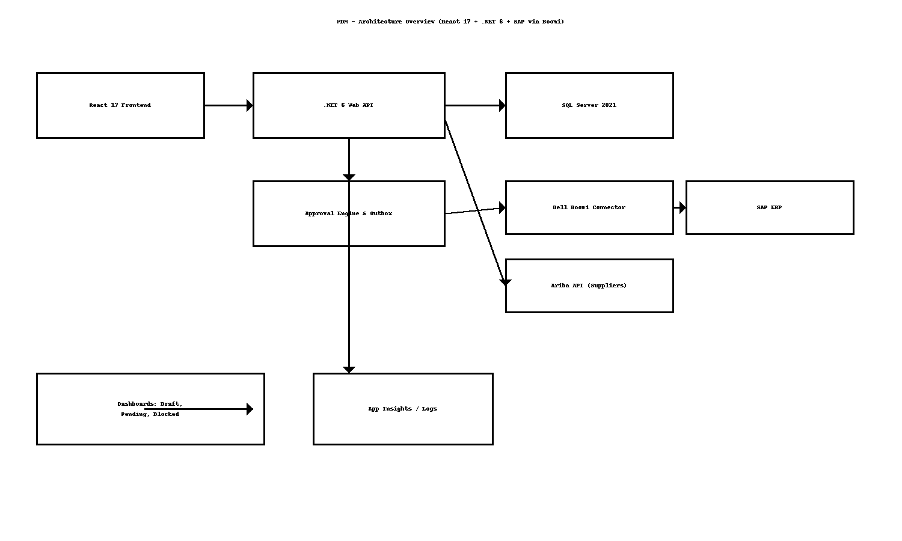

# MDM – High-Level Design (HLD)

> **Author:** Sagarika Chakraborty — Full Stack .NET Engineer | React.js | Web API | SQL Server

## 1. Overview & Scope
The **MDM** application maintains **clean, consistent supplier & customer master data** with **creation, modification, approval**, and **SAP synchronization**. Data flows through **draft -> submit -> approve/disapprove**. Approved items are synced to **SAP via Dell Boomi**; disapproved entries remain **pending**; **blocked** entities are tracked separately. The UI presents **dynamic tabs** (only **Details** initially; subsequent tabs and **Submit** appear after saving).

The system integrates with **Ariba** for supplier data (except **“v006 Employees”**, which MDM handles). **Germany SMR** and **Spain SMR** business partners are **exclusively** managed in MDM.

## 2. Architecture


```mermaid
flowchart LR
  A[React 17 Frontend] -->|JWT| B[.NET 6 Web API]
  B -->|CRUD| C[(SQL Server 2021)]
  B --> D[Approval Engine & Outbox]
  B --> E[Dashboards (Draft/Pending/Blocked)]
  D --> F[Azure/Dell Boomi Connector]
  F --> G[(SAP ERP)]
  B <-->|Suppliers| H[Ariba API]
  B --> I[App Insights / Logs]
```

## 3. Goals & NFRs
- **Data Quality**: Validation rules, required fields, duplicates prevention.
- **Security**: JWT + RBAC, TLS, audit trails, PII minimization, least privilege.
- **Reliability**: Idempotent sync; retry/backoff; outbox pattern for Boomi handoff.
- **Scalability**: Stateless API, queue-based sync; DB indexed for common filters.
- **Observability**: Correlation IDs, structured logs, dashboards for approvals & sync success.
- **Compliance**: Immutable audit logs; segregation of duties for approvers vs creators.

## 4. Component Responsibilities
- **React Frontend**: Dynamic tabbed forms; conditional controls; dashboards for Draft/Pending/Blocked; search & filters.
- **.NET 6 Web API**: Business partner services; approval engine; status transitions; outbox; Ariba adapter; Boomi connector.
- **SQL Server**: BP master, customer/supplier extensions, org mappings, approval records, outbox, audit.
- **Dell Boomi Connector**: Mediates SAP calls; handles transformations; returns SAP status/codes.
- **Ariba API Adapter**: Supplier flows (excl. v006 Employees); reconciliation with MDM state.

## 5. Data Flow (Happy Paths)
1. User starts a new BP: only **Details** tab visible → save → unlocks module tabs and **Submit**.
2. On **Submit**, API creates **ApprovalRequest**; hides Submit/Save until decision.
3. **Approve** → outbox event dispatched → **Dell Boomi** → **SAP** → status updated; Active (Company Code) toggle reflects SAP.
4. **Disapprove** → record remains **Pending**; visible on dashboard for remediation.
5. **Blocked** entities are maintained in a separate list with reason and actor.

## 6. Country & Integration Rules
- **Ariba** manages supplier data **except** “**v006 Employees**”; MDM owns customers.
- **Germany SMR** & **Spain SMR** BPs are MDM-only (bypass Ariba).
- EntityConfig controls **Address Book Type** → **BP Number** generation.

## 7. Availability & DR
- Multi-AZ hosting; automated DB backups & PITR.
- Blue/green deployments; health probes; rollback artifacts.

## 8. CI/CD & Release
- Git via **SourceTree**; feature-branch strategy; semantic version tags.
- Build/test pipelines; environment-based configs; approvals for prod.
- Post-deploy smoke tests; telemetry gates.
