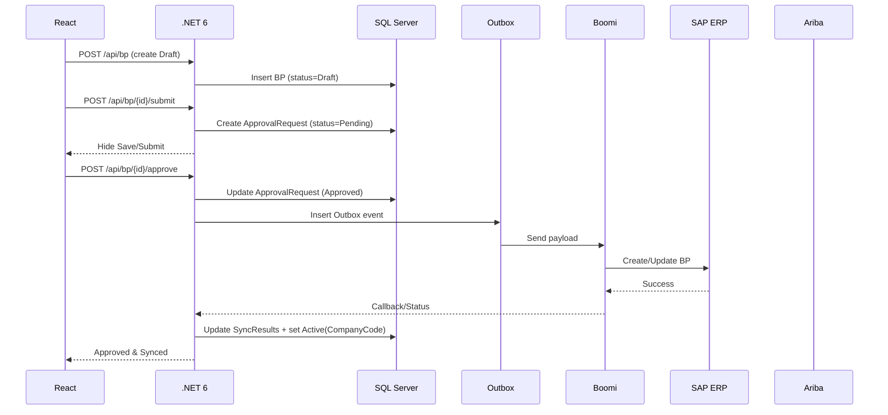

# MDM – Low-Level Design (LLD)

> **Author:** Sagarika Chakraborty — Full Stack .NET Engineer | React.js | Web API | SQL Server

## 1. Solution Layout
- **src/MDM.Api** — ASP.NET Core 6 Web API (Controllers, DI, Middleware, DTOs)
- **src/MDM.Core** — Domain models, Services, Validators, Approval Engine, Outbox, Interfaces
- **src/MDM.Infrastructure** — EF Core/Dapper Repositories, Ariba Client, Boomi Connector, Key Vault
- **web/MDM.Web** — ASP.NET Core 6 Web App (if server-side rendered areas required)
- **ui/** — React 17 app (tabs, forms, dashboards)
- **tests/** — Unit/Integration/Contract tests

## 2. Core Endpoints (sample)
### Business Partner
- `POST /api/bp` — create BP (starts in Draft)
- `GET /api/bp/{id}` — read
- `PUT /api/bp/{id}` — update (while Draft/Pending)
- `POST /api/bp/{id}/submit` — create ApprovalRequest; hide Save/Submit
- `POST /api/bp/{id}/approve` — approve & enqueue outbox
- `POST /api/bp/{id}/disapprove` — reject with reason
- `POST /api/bp/{id}/block` — block with reason; separate dashboard list

### Supplier/Customer Extensions
- `PUT /api/bp/{id}/supplier` — purchase orgs, company details
- `PUT /api/bp/{id}/customer` — sales orgs, company details
- `PUT /api/bp/{id}/addresses` — add/update addresses

### Dashboards
- `GET /api/dashboard/drafts`
- `GET /api/dashboard/pending`
- `GET /api/dashboard/blocked`

### Integration
- `POST /api/sync/boomi/{bpId}` — manual (admin) re-sync trigger
- **Background**: OutboxProcessor → Boomi → SAP; AribaAdapter for supplier reconcile

## 3. DTOs (examples)
```json
// BusinessPartnerCreateRequest
{
  "name": "Acme GmbH",
  "type": "Organization",
  "country": "DE",
  "taxId": "DE123456789",
  "masterSearchType": "ByTaxId"
}

// ApprovalDecision
{
  "bpId": "guid",
  "decision": "Approve",
  "note": "All checks passed."
}
```

## 4. Validation & Rules
- Required: name, type, country, taxId (per-country rules).
- BP Number is generated from **EntityConfig.AddressBookType**.
- State transitions: Draft -> Pending (Submit) -> Approved/Disapproved; Blocked is orthogonal.
- While Pending: Save/Submit **hidden**; edits require re-open by approver.
- Ariba handling: Suppliers via Ariba unless **v006 Employees**; Customers handled by MDM.

## 5. Persistence (ER Overview)
**Tables:**
- `BusinessPartners(id, bpNo, name, type, country, taxId, status, createdAt, updatedAt)`
- `Customers(id, bpId, salesOrgsJson, companyDetailsJson)`
- `Suppliers(id, bpId, purchaseOrgsJson, companyDetailsJson)`
- `Addresses(id, bpId, kind, line1, line2, city, state, postalCode, country)`
- `EntityConfig(id, addressBookType, bpFormat, createdAt)`
- `ApprovalRequests(id, bpId, status, submittedAt, decidedAt, decidedBy, reason)`
- `Outbox(id, bpId, payloadJson, status, retries, lastTriedAt, createdAt)`
- `SyncResults(id, bpId, system, status, message, at)`
- `BlockedList(id, bpId, reason, actorId, at)`
- `Users(id, email, hash, role, isActive, createdAt)`
- `Audit(id, actorId, entity, entityId, action, beforeJson, afterJson, at)`

**Indexes:** `BusinessPartners(bpNo) unique`, `BusinessPartners(taxId)`, `ApprovalRequests(status)`, `Outbox(status)`, `BlockedList(bpId)`.

## 6. Sequences


## 7. Error Handling
- `400` validation errors (with field-level messages)
- `401/403` JWT/RBAC
- `409` duplicate taxId/bpNo conflict; invalid state transition
- `423` pending lock (while awaiting approval)
- `5xx` integration failures (Boomi/Ariba/SAP) with retry & dead-letter after N attempts

## 8. Observability
- Correlation ID middleware; structured logging (Serilog)
- App Insights traces/metrics; custom events (`BPSubmitted`, `BPApproved`, `SAPSynced`, `AribaBypassed`)
- Dashboards: approval SLA, sync success, outbox backlog, blocked counts

## 9. Test Strategy
- **Unit**: validators, approval engine, numbering service
- **Integration**: controllers + repos + SQL testcontainer
- **Contract**: Boomi/Ariba stubs (WireMock); response mappings
- **Load**: k6/Locust on dashboard queries and submit/approve spikes
- **Security**: RBAC matrix, JWT expiry/refresh, audit immutability

## 10. Deployment & Runbooks
- Blue/green with rollback; DB backups & PITR verified
- Key rotation for Ariba/Boomi; secrets via Key Vault
- Runbooks: outbox stuck, SAP outage fallback, approval queue backlog, blocked BP review
